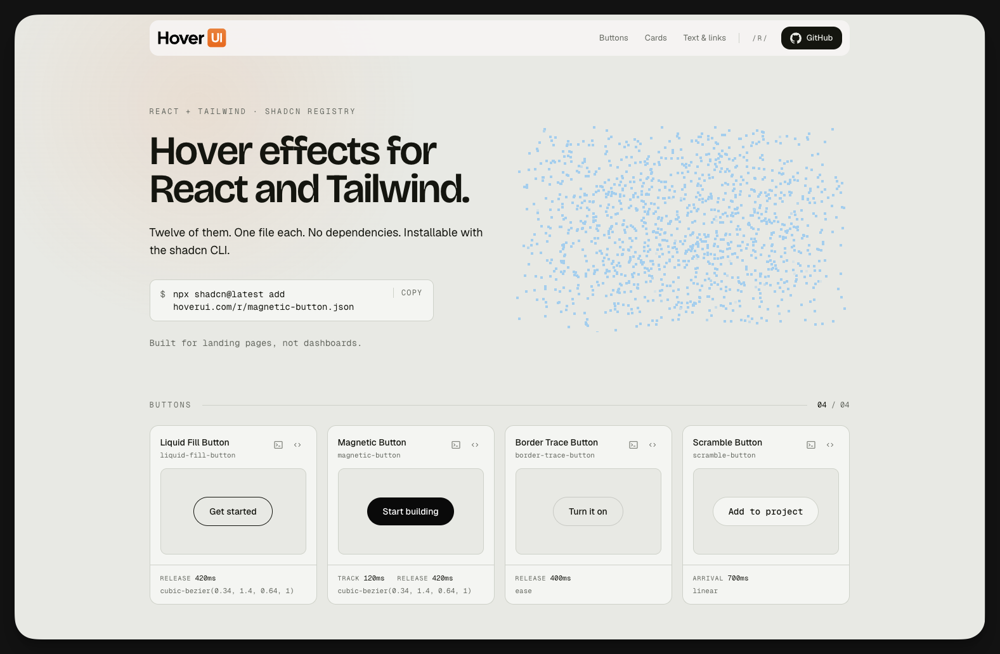

<div align="center">

# HoverUI

**Hover effects for React and Tailwind. Copy, paste, no dependencies.**

[](https://github.com/raqibnur/hoverui/actions/workflows/ci.yml)
[](LICENSE)


[Effects](#the-twelve) · [Curves](#the-curves) · [Accessibility](#accessibility) · [Roadmap](#roadmap) · [Contributing](CONTRIBUTING.md)



</div>

```bash
npx shadcn@latest add https://hoverui.com/r/magnetic-button.json
```

One file lands in `components/hover/`. Nothing is installed, nothing is added to your
`globals.css`, and there is no package to keep up to date. The code is yours from that
moment on.

> [!IMPORTANT]
> **Pre-launch.** All twelve are built and reviewed, but `hoverui.com` still serves a
> waitlist page, so the command above 404s today. Run the registry locally and install
> from `http://localhost:3000/r/<slug>.json` — see [Contributing](#contributing).

## What it's for

Landing pages, portfolios, marketing sites — surfaces a visitor arrives at once and
should remember. Deliberately **not** app chrome: in a dashboard the right amount of
hover animation is usually none, and the 420ms release curves in here would be wrong.

Not a component library either. No Button, no Card, no Dialog — shadcn/ui already won
that. HoverUI ships one thing: the hover effect.

## The twelve

Swap the slug to install any of them.

#### Buttons

| Slug | What it does |
|---|---|
| [`magnetic-button`](registry/hover/magnetic-button) | Faintly attracted to the cursor. The overshoot on release is where the personality lives. |
| [`liquid-fill-button`](registry/hover/liquid-fill-button) | Colour floods in from the exact edge the cursor crossed. |
| [`border-trace-button`](registry/hover/border-trace-button) | A point of light runs one lap of the border and settles into a low glow. |
| [`scramble-button`](registry/hover/scramble-button) | The label decodes left to right, so the eye can follow a wavefront across the word. |

#### Cards

| Slug | What it does |
|---|---|
| [`spotlight-card`](registry/hover/spotlight-card) | A soft light under the surface trails the cursor, lifting the border as it passes. |
| [`tilt-card`](registry/hover/tilt-card) | Capped at 8°, with a specular sheen that moves *opposite* the tilt. |
| [`reveal-card`](registry/hover/reveal-card) | The image recedes so the caption can rise into the space it vacated. |
| [`chase-border-card`](registry/hover/chase-border-card) | A gradient border that rotates only while hovered and eases to a stop on leave. |

#### Text and links

| Slug | What it does |
|---|---|
| [`stagger-text`](registry/hover/stagger-text) | Letters lift in a 35ms wavefront, legible at every frame. |
| [`draw-underline`](registry/hover/draw-underline) | Draws from the side you entered, retracts toward the side you left. |
| [`blur-swap-link`](registry/hover/blur-swap-link) | A camera rack focus between two labels, not a crossfade. |
| [`slide-marquee-link`](registry/hover/slide-marquee-link) | One continuous strip moving past a window, pixel-exact. |

Every entry in [`SCOPE.md`](SCOPE.md) carries an **Intent** and a **Not this** — what the
effect is, and the median version of it that was deliberately avoided.

## The curves

Published on purpose. Built-in CSS easings are too weak and read as unintentional, so
every effect draws from three:

| Token | Curve | Used for |
|---|---|---|
| `--ease-out` | `cubic-bezier(0.23, 1, 0.32, 1)` | Entering, responding to the cursor |
| `--ease-in-out` | `cubic-bezier(0.77, 0, 0.175, 1)` | Moving or morphing on screen |
| `--ease-spring` | `cubic-bezier(0.34, 1.40, 0.64, 1)` | Releasing, with slight overshoot |

Response is fast and the settle is slow — 100-140ms to track the cursor, 350-450ms to
return to rest. Symmetric timing is what makes an effect read as a CSS default.

## Accessibility

Not a footnote. It is most of [`docs/MOTION.md`](docs/MOTION.md), and it is the reason to
pick this over the fiftieth "awesome hover effects" collection.

- **Touch** — pointer work is gated on `(hover: hover) and (pointer: fine)`, so tapping
  never strands an effect mid-state, and every effect has a decided resting state that
  looks finished on its own.
- **Keyboard** — no cursor means you get the effect's *arrival* state: the fill completes,
  the underline draws, the card lifts without tilt.
- **Reduced motion** — gentler, not absent. Transforms go, colour and opacity stay.

If you find one that misses this, that is a bug and it is the highest-priority kind.

## Roadmap

| | Milestone |
|---|---|
| ✅ | Registry, gallery, and all twelve effects built |
| ✅ | Motion + accessibility gate (G1-G16) defined and applied |
| ✅ | Open source: license, contribution path, CI, registry drift check |
| ✅ | OG image, favicon, meta |
| ✅ | Verified installable from a separate project with the shadcn CLI |
| ⬜ | Close the open gate findings — see [`TASKS.md`](TASKS.md) |
| ⬜ | Deploy the registry to `hoverui.com` — it currently serves a waitlist page |
| ⬜ | The 30-second demo video, then launch ([`docs/LAUNCH.md`](docs/LAUNCH.md)) |

**The scope is frozen.** A thirteenth effect is not merged until all twelve are live —
file an [effect proposal](.github/ISSUE_TEMPLATE/effect_request.yml) and it joins the
post-launch queue.

After v1: **one new effect per week, posted as a clip.** Never an npm package, MDX docs
site, playground, Figma file, Pro tier, or framework port — every one of those is how a
previous attempt at this project died. Full list in [`SCOPE.md`](SCOPE.md).

## Using it in your project

**Requirements:** React 19, Tailwind CSS 4, and a project set up for the shadcn CLI. No
runtime dependency beyond React itself — no motion library, no GSAP, not even `clsx`.

MIT. Use the effects in anything, including commercial and closed-source work. No
attribution required and nothing to keep in your bundle — once the file is in your repo
it is ordinary source code you own.

## Contributing

Start with [`CONTRIBUTING.md`](CONTRIBUTING.md), which has the full authoring pipeline.
Fixes to the existing twelve are very welcome.

```bash
git clone https://github.com/raqibnur/hoverui.git
cd hoverui
npm ci
npm run dev
```

| File | What it covers |
|---|---|
| [`SCOPE.md`](SCOPE.md) | The frozen twelve, with Intent and Not this. Read before building anything. |
| [`docs/AUTHORING.md`](docs/AUTHORING.md) | How to write an effect, with the reference implementation. |
| [`docs/MOTION.md`](docs/MOTION.md) | G1-G16, the motion and accessibility gate. Non-negotiable. |
| [`docs/FIXES.md`](docs/FIXES.md) | The canonical repair for every gate. |
| [`docs/REGISTRY.md`](docs/REGISTRY.md) | registry.json, build, serve, deploy, namespace. |
| [`docs/LAUNCH.md`](docs/LAUNCH.md) | What ships on launch day, and what deliberately doesn't. |
| [`CLAUDE.md`](CLAUDE.md) | The five hard rules and the working agreements. |

## License

[MIT](LICENSE) © Raqib Nur
